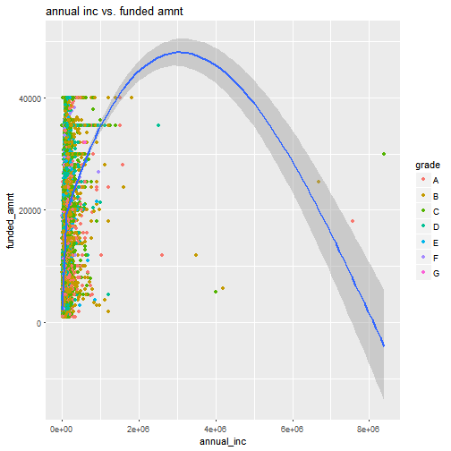
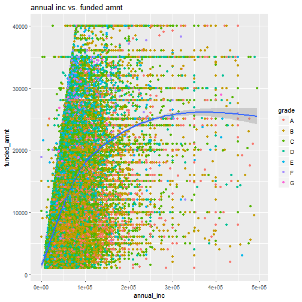
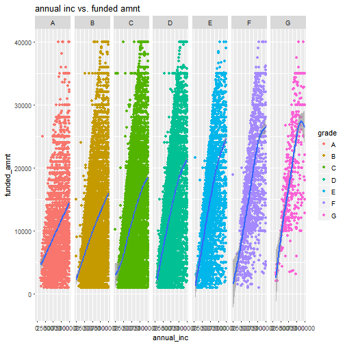
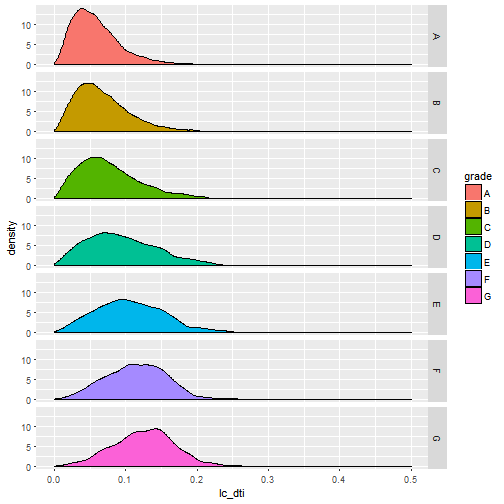
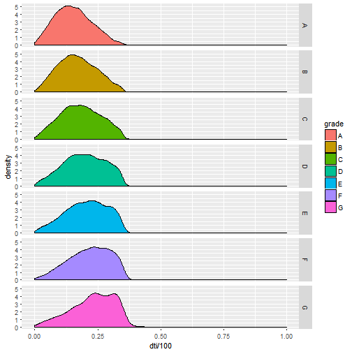
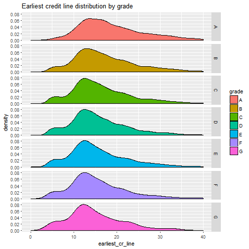
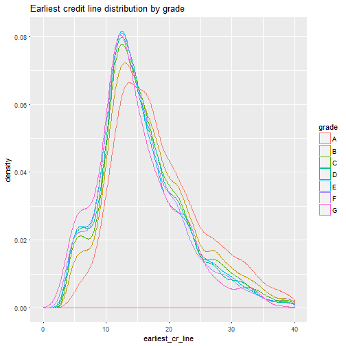
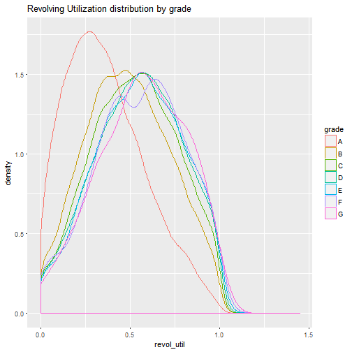
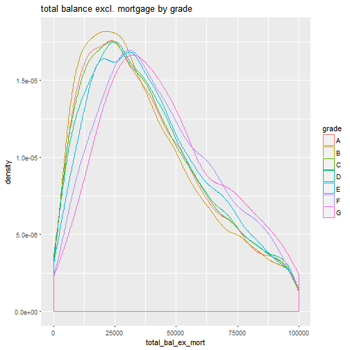

## Introduction

Lending Club is the largest p2p lending platform. Other than helping diversify personal investment, LC provides a perfect dataset to get started with data analysis: data maniupuation, data visualization and predictive analysis using machine learning techniques. I've always wanted to take a deeper look and analyze the dataset myself, as it might provide some unintuitive insight. Hopefully the insight could also be invaluable to my lending decision.

With a quick google search, you can find there are many data hobbyist who have done similar work:

* My very original inspiration is from Kevin Davenport: http://kldavenport.com/lending-club-data-analysis-revisted-with-python/ 
* Kaggle: https://www.kaggle.com/ashokn30/d/wendykan/lending-club-loan-data/lending-club-data-some-insights


There's no need to repeat the good work that they have done. To be different and provide some new idea to the community, I want to use my own approach to answer my own questions. 

## What's different?

I personally went through mortgage application twice. Throughout the process I've had a strong impression that mortgage lenders reiterate on the following 3 factors whether to approve a loan: 

1. Annual income
2. DTI ratio
3. FICO score (One score that summarises credit conditions: credity history, open credit lines, credit utilitization, etc.)


Lenders must have done a lot of work and have evidence that these are the most critical things to focus on. So, how about we use them as granted that they will also be the most influential factors for personal lending as well? How do they display in lending club's dataset? Can we use them to predict bad/good loan?


## Walk through

Lending Club's public loan data can be downloaded from [here](https://www.lendingclub.com/info/download-data.action). I am using 2016Q3 data which is the most recent.

The R implementation mainly requires the following two pacakges. 

```r
# for data manipulation
library(dplyr)
# for data visualization
library(ggplot2)
```

The first row and last two rows of the csv file are irrelevant but screws up the headers which display on the second row. We use read.csv(.., skip = 1) to ignore first row. Then further remove the last two rows.

```r
data <- read.csv('LoanStats_2016Q3.csv', stringsAsFactors = F, skip = 1)
data <- head(data, -2)
```

As always, we need to have a peek of what's in the dataset. 

```r
dim(data)
```

```
## [1] 99120   111
```

```r
names(data)
```

```
##   [1] "id"                             "member_id"                     
##   [3] "loan_amnt"                      "funded_amnt"                   
##   [5] "funded_amnt_inv"                "term"                          
##   [7] "int_rate"                       "installment"                   
##   [9] "grade"                          "sub_grade"                     
##  [11] "emp_title"                      "emp_length"                    
##  [13] "home_ownership"                 "annual_inc"                    
##  [15] "verification_status"            "issue_d"                       
##  [17] "loan_status"                    "pymnt_plan"                    
##  [19] "url"                            "desc"                          
##  [21] "purpose"                        "title"                         
##  [23] "zip_code"                       "addr_state"                    
##  [25] "dti"                            "delinq_2yrs"                   
##  [27] "earliest_cr_line"               "inq_last_6mths"                
##  [29] "mths_since_last_delinq"         "mths_since_last_record"        
##  [31] "open_acc"                       "pub_rec"                       
##  [33] "revol_bal"                      "revol_util"                    
##  [35] "total_acc"                      "initial_list_status"           
##  [37] "out_prncp"                      "out_prncp_inv"                 
##  [39] "total_pymnt"                    "total_pymnt_inv"               
##  [41] "total_rec_prncp"                "total_rec_int"                 
##  [43] "total_rec_late_fee"             "recoveries"                    
##  [45] "collection_recovery_fee"        "last_pymnt_d"                  
##  [47] "last_pymnt_amnt"                "next_pymnt_d"                  
##  [49] "last_credit_pull_d"             "collections_12_mths_ex_med"    
##  [51] "mths_since_last_major_derog"    "policy_code"                   
##  [53] "application_type"               "annual_inc_joint"              
##  [55] "dti_joint"                      "verification_status_joint"     
##  [57] "acc_now_delinq"                 "tot_coll_amt"                  
##  [59] "tot_cur_bal"                    "open_acc_6m"                   
##  [61] "open_il_6m"                     "open_il_12m"                   
##  [63] "open_il_24m"                    "mths_since_rcnt_il"            
##  [65] "total_bal_il"                   "il_util"                       
##  [67] "open_rv_12m"                    "open_rv_24m"                   
##  [69] "max_bal_bc"                     "all_util"                      
##  [71] "total_rev_hi_lim"               "inq_fi"                        
##  [73] "total_cu_tl"                    "inq_last_12m"                  
##  [75] "acc_open_past_24mths"           "avg_cur_bal"                   
##  [77] "bc_open_to_buy"                 "bc_util"                       
##  [79] "chargeoff_within_12_mths"       "delinq_amnt"                   
##  [81] "mo_sin_old_il_acct"             "mo_sin_old_rev_tl_op"          
##  [83] "mo_sin_rcnt_rev_tl_op"          "mo_sin_rcnt_tl"                
##  [85] "mort_acc"                       "mths_since_recent_bc"          
##  [87] "mths_since_recent_bc_dlq"       "mths_since_recent_inq"         
##  [89] "mths_since_recent_revol_delinq" "num_accts_ever_120_pd"         
##  [91] "num_actv_bc_tl"                 "num_actv_rev_tl"               
##  [93] "num_bc_sats"                    "num_bc_tl"                     
##  [95] "num_il_tl"                      "num_op_rev_tl"                 
##  [97] "num_rev_accts"                  "num_rev_tl_bal_gt_0"           
##  [99] "num_sats"                       "num_tl_120dpd_2m"              
## [101] "num_tl_30dpd"                   "num_tl_90g_dpd_24m"            
## [103] "num_tl_op_past_12m"             "pct_tl_nvr_dlq"                
## [105] "percent_bc_gt_75"               "pub_rec_bankruptcies"          
## [107] "tax_liens"                      "tot_hi_cred_lim"               
## [109] "total_bal_ex_mort"              "total_bc_limit"                
## [111] "total_il_high_credit_limit"
```

We use dplyr's select function to extract the columns that we want that are related to the 4 factors I mentioned earlier. 

Select loan related fields:

* _grade_
* _sub_grade_
* _loan_status_
* _funded_amnt_
* _term_
* _int_rate_
* _installment_

Annual Income

* _annual_inc_

DTI Ratio

* _dti_

However I am not able to find FICO score field anymore. Reason 'seems' to be that LC removed this field somewhere along the road before they went public (see reference [here](http://www.lendacademy.com/lending-club-removes-data-fields/)). If I take a guess, FICO has been proven highly correlated to LC's algorithm, as a result of that, to reduce transparency LC decided to cut it out. Instead, LC releases the FICO attributes such as 


which means, unfortunately for me, I need more work. To mimic the FICO score, we can use this 


as a reference, and include relevant fields into the final data frame.

FICO related

* _earliest_cr_line_
* _revol_util_
* _inq_last_12m_
* _total_bal_ex_mort_

and various other fields for future analysis (_purpose_, _emp_title_, _emp_length_, _state of address_) 
I have now formed the data.frame for analysis.

```r
mydata <- select(data, 
              grade, sub_grade, loan_status, funded_amnt, term, int_rate, installment, 
              annual_inc, 
              dti, 
              earliest_cr_line, revol_util, inq_last_12m, total_bal_ex_mort,
              purpose, emp_title, emp_length, addr_state)
```

Let's see what type of data we have included in mydata

```r
str(mydata)
```

```
## 'data.frame':	99120 obs. of  17 variables:
##  $ grade            : chr  "B" "C" "D" "B" ...
##  $ sub_grade        : chr  "B4" "C4" "D1" "B1" ...
##  $ loan_status      : chr  "Fully Paid" "Current" "Current" "Fully Paid" ...
##  $ funded_amnt      : int  30000 14000 10000 2600 12000 5000 15000 30000 15000 10000 ...
##  $ term             : chr  " 36 months" " 36 months" " 36 months" " 36 months" ...
##  $ int_rate         : chr  " 10.99%" " 14.49%" " 16.99%" "  8.99%" ...
##  $ installment      : num  982 481.8 356.5 82.7 271.8 ...
##  $ annual_inc       : num  80000 53000 101000 35000 62000 70000 67000 63300 75000 65000 ...
##  $ dti              : num  22.58 16.98 7.84 6.73 28.26 ...
##  $ earliest_cr_line : chr  "Sep-1999" "Sep-2004" "May-1998" "Sep-2009" ...
##  $ revol_util       : chr  "69.7%" "87.2%" "50.5%" "1.4%" ...
##  $ inq_last_12m     : int  0 0 3 1 3 1 0 0 1 2 ...
##  $ total_bal_ex_mort: int  39827 58506 22887 19497 108236 27102 133970 48251 57840 61171 ...
##  $ purpose          : chr  "debt_consolidation" "debt_consolidation" "home_improvement" "moving" ...
##  $ emp_title        : chr  "server" "Postdoctoral Researcher" "Sr. Business Analyst" "Loaner Coordinator" ...
##  $ emp_length       : chr  "2 years" "2 years" "10+ years" "3 years" ...
##  $ addr_state       : chr  "NY" "PA" "MA" "OR" ...
```

For numeric analysis purpose, we need to convert some of the chr object to numeric, e.g. interest rate displaying as a charactor '11.5%' need to be converted to 0.115 as a numeric value. _earliest_cr_line_ needs some special treatment. Currently it displays the first date when credit line was opened, but to me, I am more interested in the total length in **years** since it was open. So we need to apply some transformation there.


```r
mydata$term <- as.numeric(substr(mydata$term, 1,3))
mydata$emp_length <- as.numeric(substr(mydata$emp_length, 1,2))
mydata$int_rate <- as.numeric(gsub("%", "", mydata$int_rate)) / 100
mydata$revol_util <- as.numeric(gsub("%", "", mydata$revol_util)) / 100
mydata$earliest_cr_line <- as.numeric(difftime(Sys.Date(), as.Date(paste("01-",mydata$earliest_cr_line,sep=''), format = "%d-%b-%Y")),units = 'days')/365
```

Let's check again

```r
str(mydata)
```

```
## 'data.frame':	99120 obs. of  17 variables:
##  $ grade            : chr  "B" "C" "D" "B" ...
##  $ sub_grade        : chr  "B4" "C4" "D1" "B1" ...
##  $ loan_status      : chr  "Fully Paid" "Current" "Current" "Fully Paid" ...
##  $ funded_amnt      : int  30000 14000 10000 2600 12000 5000 15000 30000 15000 10000 ...
##  $ term             : num  36 36 36 36 60 36 36 60 36 36 ...
##  $ int_rate         : num  0.1099 0.1449 0.1699 0.0899 0.1279 ...
##  $ installment      : num  982 481.8 356.5 82.7 271.8 ...
##  $ annual_inc       : num  80000 53000 101000 35000 62000 70000 67000 63300 75000 65000 ...
##  $ dti              : num  22.58 16.98 7.84 6.73 28.26 ...
##  $ earliest_cr_line : num  17.63 12.62 18.96 7.62 11.45 ...
##  $ revol_util       : num  0.697 0.872 0.505 0.014 0.263 0.174 0.584 0.906 0.145 0.187 ...
##  $ inq_last_12m     : int  0 0 3 1 3 1 0 0 1 2 ...
##  $ total_bal_ex_mort: int  39827 58506 22887 19497 108236 27102 133970 48251 57840 61171 ...
##  $ purpose          : chr  "debt_consolidation" "debt_consolidation" "home_improvement" "moving" ...
##  $ emp_title        : chr  "server" "Postdoctoral Researcher" "Sr. Business Analyst" "Loaner Coordinator" ...
##  $ emp_length       : num  2 2 10 3 3 8 3 10 8 10 ...
##  $ addr_state       : chr  "NY" "PA" "MA" "OR" ...
```
Data look good for analysis now. let's start with **Annual Income**.

### What is the range of salary? Do high income borrowers tend to get funded more?


```r
ggplot(mydata, aes(annual_inc, funded_amnt)) + 
  geom_point(aes(colour = grade)) +
  labs(title = 'annual inc vs. funded amnt') +
  geom_smooth()
```



It appears that there are some extremely high income borrowers still borrowing money! I am talking about super duper high income. This one guy has an annual income of 


```r
max(mydata$annual_inc)
```

```
## [1] 8400000
```

Unbelievable! An annual income of $8.4 million that's comparable to C level of top 10 public companies... who is this guy?

```r
mydata[which(mydata$annual_inc == max(mydata$annual_inc)),]$emp_title
```

```
## [1] "Mechanical Mobile Inspector"
```

What? a Mechanical Mobile Inspector??? I don't think this is a valid information. Apparantely LC didn't do a good job maintaining the data very well. Let's see what are other high income profile's loan data look like.

```r
mydata[which(mydata$annual_inc > 1000000),]$emp_title
```

```
##  [1] "Program Director"                    
##  [2] "Driving Instructor"                  
##  [3] "Senior Vice President"               
##  [4] "Equity Partner"                      
##  [5] "Systems Engineer"                    
##  [6] "Portfolio Manager"                   
##  [7] "Partner"                             
##  [8] "Managing Director"                   
##  [9] "Managing Director"                   
## [10] "Cfo"                                 
## [11] "Managing Director"                   
## [12] "Manager"                             
## [13] "President"                           
## [14] "Senior Video Producer"               
## [15] "Warehouse"                           
## [16] "cna"                                 
## [17] "Captain"                             
## [18] "Teacher"                             
## [19] "Practice Administrator "             
## [20] "Mechanical Mobile Inspector"         
## [21] "Vice President"                      
## [22] "Managing director "                  
## [23] "Managing Director "                  
## [24] "Partner"                             
## [25] "Medical Director"                    
## [26] "Senior Director, Program Development"
## [27] "Managing Director"                   
## [28] "Senior VP of Wholesale Trading"      
## [29] "Dietary"                             
## [30] "Managing Director"
```

Well, most of million dollar salaried people have legitimate titles such as managing director, svp, portfolio manager, partner but there are teacher? dietary? I hope these are really the handful cases of bad data. But to push forward with my analysis, I decide to get rid of profiles that have annual income of greater than $500k. Just a hard cut off line under my discretion.

```r
mydata <- filter(mydata, annual_inc < 500000)
```
Replot the annual income vs. funded amount chart.

```r
p <- ggplot(mydata, aes(annual_inc, funded_amnt)) +
  geom_point(aes(colour = grade)) +
  labs(title = 'annual inc vs. funded amnt') +
  geom_smooth()
p
```



Much better! We know that LC cap the funding limit to $40k so we see no high funded amount greater than that. Overall we see a pretty linear relationship for annual income < $100k. Beyond that, we see the regression line going flat due to the hard cap of $40k. If we drill in to < $100k annual income borrowers, we will see a clearer linear relationship. 

```r
p + xlim(0,100000) + facet_grid(. ~ grade) + geom_smooth()
```



The steepness of the regression line confirms that the more money borrowed relative to income, the higher risk (lower grade) the loan is. At this point, there is no doubt that annual income is one major factor to determine the grade of a loan. A better way to look at the slope is to use (installment / monthly income) ratio. 


```r
# Add a new column called lc_dti
mydata <- mutate(mydata, monthly_inc = annual_inc/12, lc_dti = installment/monthly_inc)

# lc_dti density by grade
ggplot(data = mydata, aes(lc_dti)) + xlim(0,0.5) +
  geom_density(aes(fill = grade)) +
  facet_grid(grade ~ .)
```


The lending club obligation to monthly income displays interesting results. For high-grade loan, the majority of the borrowers will not commit more than 10% of the income on Lending club loan while low-grade borrowers do tend to exceed that threshold. My rule of thumb is that, if you are able to find the monthly repayment < 10% of the borrower's income, this would tend to be a good loan. 

### Debt-to-Income Ratio (DTI)
In fact, I have just constructed a Lending Club specific DTI ratio above using LC's monthly payment divided by monthly income, in which we've found it useful in distinguishing grades. The DTI in the dataset is a more generally heard one that excludes mortgage but include all other debts such as credit card, car loan etc. So let's see what those reported DTI is telling. 

```r
d <- ggplot(data = mydata, aes(dti/100)) + xlim(0,1)
d <- d + geom_density(aes(fill = grade))
d + facet_grid(grade ~ .)
```



dti displays similar feature as lc_dti with high grade loan skew to the right and low grade to the left 

### How about LC_DTI / DTI Ratio? This will answer how much LC Debt borrowers is willing to obligate in addition to existing debt.


```r
mydata <- mutate(mydata, lcd_to_tot_debt = lc_dti / (dti/100))
ggplot(data = mydata, aes(lcd_to_tot_debt)) + xlim(0,1) +
  geom_density(aes(fill = grade)) +
  facet_grid(grade ~ .)
```


Even the majority of the worst grade (G) loan would not comprise more than 50% of the total debt. So, Lending Club is surely **NOT** the major lenders that most people take loan from. If someone took more debt on LC than anywhere else, he/she is likely have financial issue.  

### Let's move on to the FICO attributes


```r
ggplot(data = mydata, aes(earliest_cr_line)) + 
  geom_density(aes(fill = grade)) + 
  facet_grid(grade ~.) + 
  xlim(0,40) + 
  labs(title = 'Earliest credit line distribution by grade') 
```



According to the distribution plots, you can generally tell that regardless of loan grade, most of the borrowers have credit history of approximately 12 years. Shapes of the distribution are similar as well with higher grade's having fatter tails towards longer history. On the opposite side, lower grade displays positive skew. A better plot would be to put all distributions under one pane overlaying each other. That is,


```r
ggplot(data = mydata, aes(earliest_cr_line)) + 
  geom_density(aes(colour = grade)) + 
  xlim(0,40) + 
  labs(title = 'Earliest credit line distribution by grade') 
```



Unlike what we've seen on funded amount and DTI factors, if you ask me which loan is a better loan solely by looking at the credit history, my answer is I can't tell. Because the margin (difference) between different distributions is so marginal especially between low grades. 

Although a tendency that longer credit history indicates higher quality, the edge isn't as big as the previous plot shows. I personally don't think the length of credit history is a strong determining factor for grading. Let's move on to the other three attributes.


```r
ggplot(data = mydata, aes(revol_util)) + 
  geom_density(aes(colour = grade)) + 
  labs(title = 'Revolving Utilization distribution by grade') 
```



```r
ggplot(data = mydata, aes(inq_last_12m)) + 
  geom_density(aes(colour = grade, fill = grade)) + 
  labs(title = 'Last 12m Inquiry by grade') + xlim(0,30) +
  facet_wrap( ~ grade)
```


```r
ggplot(data = mydata, aes(total_bal_ex_mort)) + 
  geom_density(aes(colour = grade)) + 
  labs(title = 'total balance excl. mortgage by grade') + 
  xlim(0,100000)
```



These three plots explains the other three FICO attributes.

* The revolving utilization among different grade displays a centralization at 0.5 but with one exception - Grade A loans that has significantly below 0.5, somewhere at 0.25. Again this isn't too good a indicative plot that anticipated to display smoother transition between grades. The only solid information is the low revovling utilization in Grade A holders. 

* Last 12m credit inquiry is also indifferentiable. The number of inquiry between different grades generally cluster below 20. The only difference lies in the tails. Again this is minor. 

* total balance excl mortgage. The difference above 25k is indifferentiable again. The less amount owed, the higher grade the loan is. That is reasonable but again this isn't a very strong differentiator. 

Overall, none of the FICO attributes provides a visually strong indication of the loan quality. Although there are a few observations that could be helpful in indentifying extremely good quality borrowers, for the majority of loans, these 4 attributes ain't very differentiable. 

Since we can't visualize it, can we try the machine learning way? 

## Machine Learning

### Multiclassification using Random Forest

Let's define our problem. Previously we've established a strong belief that Annual Income and DTI are two major factors of a high quality loan. But there are still many input variables that we have not investigated into, especially my hypothesis that the FICO attributes may also be a major identifiers of a good loan. 

Let's set aside Annual Income and DTI, leaving the rest of the input variables as our focus going forward. Also, installment and funded_amnt are directly related to DTI, so can be excluded as well. I want to know, without the apparent factors, using the rest, can we also find some hidden relationship between them and the predictions which is the grade of the loan. Since "grade" has 7 levels, this will become a multiclassificaion problem.


```r
mydata_ex <- select(mydata, grade, term, int_rate, earliest_cr_line, revol_util, inq_last_12m, total_bal_ex_mort, purpose, emp_title, emp_length, addr_state)

# Convert chr columns to factors
mydata_ex[sapply(mydata_ex, is.character)] <- lapply(mydata_ex[sapply(mydata_ex, is.character)], as.factor)

str(mydata_ex)
```

```
## 'data.frame':	98926 obs. of  11 variables:
##  $ grade            : Factor w/ 7 levels "A","B","C","D",..: 2 3 4 2 3 2 3 5 1 2 ...
##  $ term             : num  36 36 36 36 60 36 36 60 36 36 ...
##  $ int_rate         : num  0.1099 0.1449 0.1699 0.0899 0.1279 ...
##  $ earliest_cr_line : num  17.63 12.62 18.96 7.62 11.45 ...
##  $ revol_util       : num  0.697 0.872 0.505 0.014 0.263 0.174 0.584 0.906 0.145 0.187 ...
##  $ inq_last_12m     : int  0 0 3 1 3 1 0 0 1 2 ...
##  $ total_bal_ex_mort: int  39827 58506 22887 19497 108236 27102 133970 48251 57840 61171 ...
##  $ purpose          : Factor w/ 13 levels "car","credit_card",..: 3 3 4 8 2 3 2 3 4 3 ...
##  $ emp_title        : Factor w/ 37370 levels "","  Ag","  Registered nurse ",..: 30615 24568 32292 18686 4795 17483 31349 6590 11716 12955 ...
##  $ emp_length       : num  2 2 10 3 3 8 3 10 8 10 ...
##  $ addr_state       : Factor w/ 50 levels "AK","AL","AR",..: 34 38 19 37 10 14 14 27 34 27 ...
```

Since int_rate are set according to grade, or vice versa. Due to high correlation by nature, this will dominate the predictor rank which are not helpful for us. I can drop this column. 

emp_title contains 37370 levels, which would be highly independent (random) to the grade, I would not want to overcomplicate my problem, hence this can be dropped. 


```r
mydata_ex <- select(mydata_ex, -int_rate, -emp_title)
```

Since randomForest doesn't take input containing NAs, I want to know if any of the input variables contain NAs, and how many of them. 


```r
colSums(is.na(mydata_ex))
```

```
##             grade              term  earliest_cr_line        revol_util 
##                 0                 0                 0                59 
##      inq_last_12m total_bal_ex_mort           purpose        emp_length 
##                 0                 0                 0             13018 
##        addr_state 
##                 0
```

revol_util contains 59 NAs while emp_length seems to have a bigger problem which contains 13018 NAs. If removing all the observations that contain NAs, I will lose 14% of my samples. This is not too bad because after all we still have a pretty decent size of sample.  


```r
mydata_ex <- na.omit(mydata_ex)
nrow(mydata_ex)
```

```
## [1] 85860
```

Now, I can throw in the Random Forest Classifier


```r
library(randomForest)

# build a Random Forest
rf <- randomForest(data = mydata_ex, grade~., ntree = 100, mtry = 3, importance = T, keep.forest = T, na.action = na.omit)
rf
```

```
## 
## Call:
##  randomForest(formula = grade ~ ., data = mydata_ex, ntree = 100,      mtry = 3, importance = T, keep.forest = T, na.action = na.omit) 
##                Type of random forest: classification
##                      Number of trees: 100
## No. of variables tried at each split: 3
## 
##         OOB estimate of  error rate: 61.03%
## Confusion matrix:
##      A     B     C    D   E  F G class.error
## A 2597  5421  1550   82   3  0 0   0.7309645
## B 2265 15254  9706  735  59  9 0   0.4557585
## C  997 11143 14250 1756 315 45 2   0.5001403
## D  269  3904  6903 1136 289 43 1   0.9094460
## E   48   940  2846  633 204 32 0   0.9566234
## F    9   244  1202  332 131 22 1   0.9886656
## G    1    37   284   96  54 10 0   1.0000000
```

That's a pretty bad classifer isn't it. This is no surprise because we wasn't able to find patterns by visualizing the relationship. There is unlikely any predictive power in those factors. Additionally, and which I found most difficult to handle in many real cases is that the imbalanced of the classes in the dataset You can easily tell that, the majority of the loan grades lies in B, C and D, while the two ends are only a small fraction of the total loans. 


```r
summarise(group_by(mydata_ex, grade), n = n())
```

```
## # A tibble: 7 × 2
##    grade     n
##   <fctr> <int>
## 1      A  9653
## 2      B 28028
## 3      C 28508
## 4      D 12545
## 5      E  4703
## 6      F  1941
## 7      G   482
```

This is where I can use my own in output re-engineering, instead of classifying into 7, with highly imbalanced dataset. Can I re-define the problem into a binary 2-class problem. Good loans for those in Grade A and B, while bad loans are the rest from Grade C to G? 

This way of simplification might help my classifier do a better job with a much more balanced output variables.

A simple transformation can be done by:


```r
Good <- c('A','B')
mydata_ex <- mutate(mydata_ex, label = ifelse(grade %in% Good, 1,0))
mydata_ex$label <- factor(mydata_ex$label)
mydata_ex$grade <- NULL

rf2 <- randomForest(data = mydata_ex, label~., ntree = 100, mtry = 3, importance = T, keep.forest = T, na.action = na.omit)
rf2
```

```
## 
## Call:
##  randomForest(formula = label ~ ., data = mydata_ex, ntree = 100,      mtry = 3, importance = T, keep.forest = T, na.action = na.omit) 
##                Type of random forest: classification
##                      Number of trees: 100
## No. of variables tried at each split: 3
## 
##         OOB estimate of  error rate: 41.76%
## Confusion matrix:
##       0    1 class.error
## 0 47529  650  0.01349136
## 1 35202 2479  0.93421088
```

after re-label the output variables still doesn't yield a better classifier. As you can see now the classifier is heavily biased to predicting loan as bad loan! This again suggests that none of the features is capable of distinguish bad/good loan. You would think that, employment length, revolcing utilization might intuitively show some potential. But, just as the same as what we did using visualizaion approach, there is no clear evidence. 


