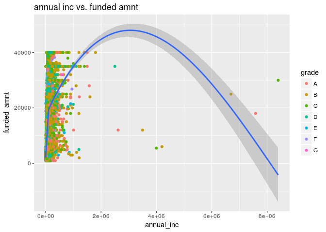
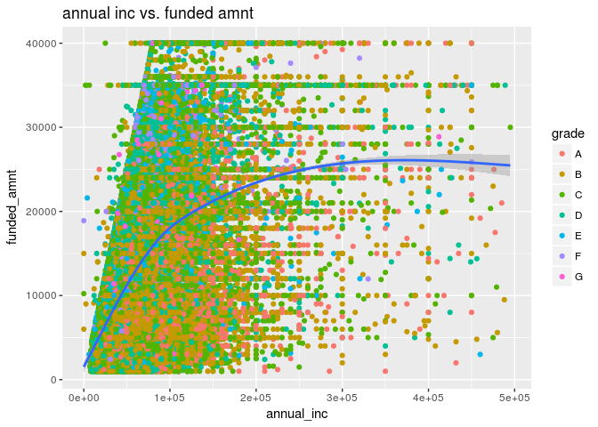
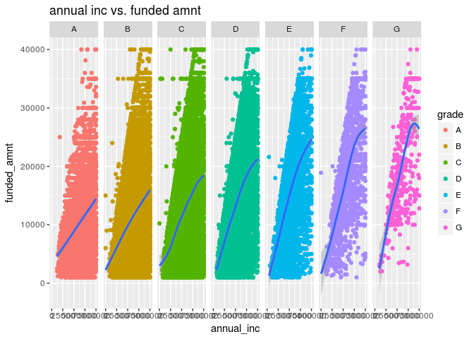
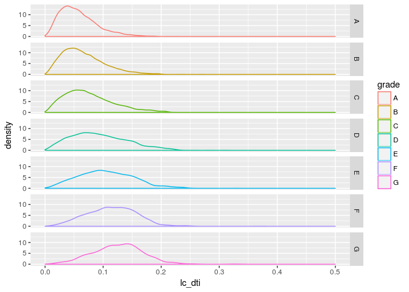
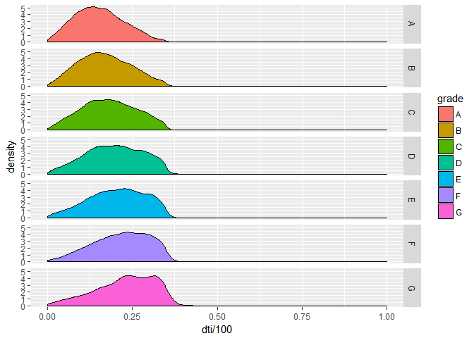
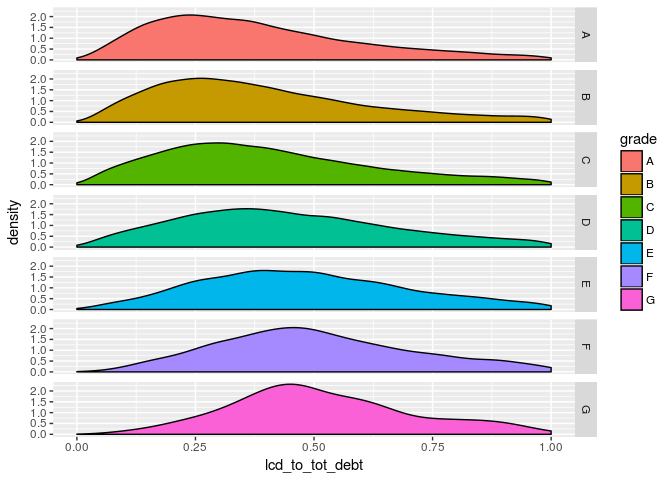
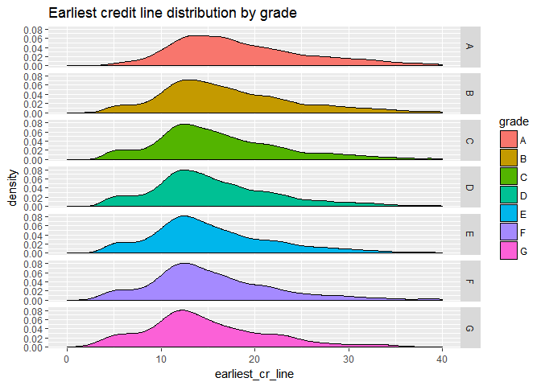
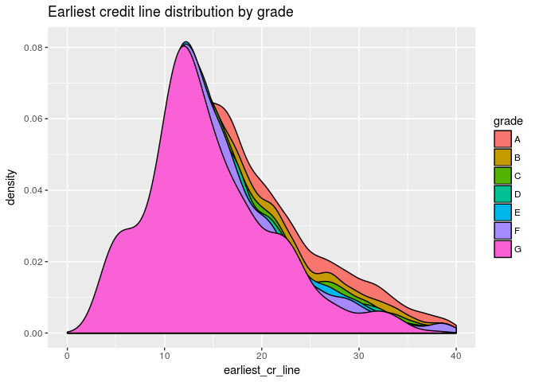
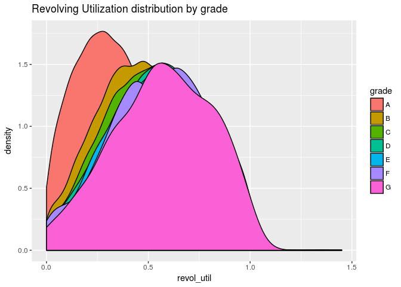
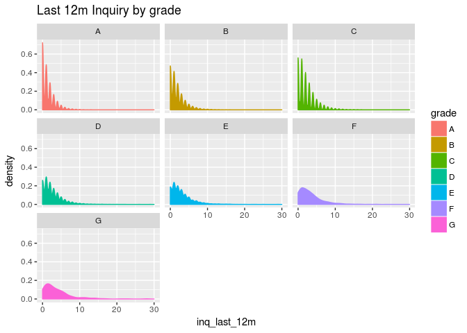

Approaching Lending Club Data with R
================

Introduction
------------

Lending Club is the largest p2p lending platform. Other than helping diversify personal investment, LC provides a perfect dataset to get started with data analysis: data maniupuation, data visualization and predictive analysis using machine learning techniques. I've always wanted to take a deeper look and analyze the dataset myself, as it might provide some unintuitive insight. Hopefully the insight could also be invaluable to my lending decision.

With a quick google search, you can find there are many data hobbyist who have done similar work:

-   My very original inspiration is from Kevin Davenport: <http://kldavenport.com/lending-club-data-analysis-revisted-with-python/>
-   Kaggle: <https://www.kaggle.com/ashokn30/d/wendykan/lending-club-loan-data/lending-club-data-some-insights>

There's no need to repeat the good work that they have done. To be different and provide some new idea to the community, I want to use my own approach to answer my own questions.

What's different?
-----------------

I personally went through mortgage application twice. Throughout the process I've had a strong impression that mortgage lenders reiterate on the following 3 factors whether to approve a loan:

1.  Annual income
2.  DTI ratio
3.  FICO score (One score that summarises credit conditions: credity history, open credit lines, credit utilitization, etc.)

Lenders must have done a lot of work and have evidence that these are the most critical things to focus on. So, how about we use them as granted that they will also be the most influential factors for personal lending as well? How do they display in lending club's dataset? Can we use them to predict bad/good loan?

Walk through
------------

Lending Club's public loan data can be downloaded from [here](https://www.lendingclub.com/info/download-data.action). I am using 2016Q3 data which is the most recent.

The R implementation mainly requires the following two pacakges.

``` r
# for data manipulation
library(dplyr)
# for data visualization
library(ggplot2)
```

The first row and last two rows of the csv file are irrelevant but screws up the headers which display on the second row. We use read.csv(.., skip = 1) to ignore first row. Then further remove the last two rows.

``` r
data <- read.csv('LoanStats_2016Q3.csv', stringsAsFactors = F, skip = 1)
data <- head(data, -2)
```

As always, we need to have a peek of what's in the dataset.

``` r
dim(data)
```

    ## [1] 99120   111

``` r
names(data)
```

    ##   [1] "id"                             "member_id"                     
    ##   [3] "loan_amnt"                      "funded_amnt"                   
    ##   [5] "funded_amnt_inv"                "term"                          
    ##   [7] "int_rate"                       "installment"                   
    ##   [9] "grade"                          "sub_grade"                     
    ##  [11] "emp_title"                      "emp_length"                    
    ##  [13] "home_ownership"                 "annual_inc"                    
    ##  [15] "verification_status"            "issue_d"                       
    ##  [17] "loan_status"                    "pymnt_plan"                    
    ##  [19] "url"                            "desc"                          
    ##  [21] "purpose"                        "title"                         
    ##  [23] "zip_code"                       "addr_state"                    
    ##  [25] "dti"                            "delinq_2yrs"                   
    ##  [27] "earliest_cr_line"               "inq_last_6mths"                
    ##  [29] "mths_since_last_delinq"         "mths_since_last_record"        
    ##  [31] "open_acc"                       "pub_rec"                       
    ##  [33] "revol_bal"                      "revol_util"                    
    ##  [35] "total_acc"                      "initial_list_status"           
    ##  [37] "out_prncp"                      "out_prncp_inv"                 
    ##  [39] "total_pymnt"                    "total_pymnt_inv"               
    ##  [41] "total_rec_prncp"                "total_rec_int"                 
    ##  [43] "total_rec_late_fee"             "recoveries"                    
    ##  [45] "collection_recovery_fee"        "last_pymnt_d"                  
    ##  [47] "last_pymnt_amnt"                "next_pymnt_d"                  
    ##  [49] "last_credit_pull_d"             "collections_12_mths_ex_med"    
    ##  [51] "mths_since_last_major_derog"    "policy_code"                   
    ##  [53] "application_type"               "annual_inc_joint"              
    ##  [55] "dti_joint"                      "verification_status_joint"     
    ##  [57] "acc_now_delinq"                 "tot_coll_amt"                  
    ##  [59] "tot_cur_bal"                    "open_acc_6m"                   
    ##  [61] "open_il_6m"                     "open_il_12m"                   
    ##  [63] "open_il_24m"                    "mths_since_rcnt_il"            
    ##  [65] "total_bal_il"                   "il_util"                       
    ##  [67] "open_rv_12m"                    "open_rv_24m"                   
    ##  [69] "max_bal_bc"                     "all_util"                      
    ##  [71] "total_rev_hi_lim"               "inq_fi"                        
    ##  [73] "total_cu_tl"                    "inq_last_12m"                  
    ##  [75] "acc_open_past_24mths"           "avg_cur_bal"                   
    ##  [77] "bc_open_to_buy"                 "bc_util"                       
    ##  [79] "chargeoff_within_12_mths"       "delinq_amnt"                   
    ##  [81] "mo_sin_old_il_acct"             "mo_sin_old_rev_tl_op"          
    ##  [83] "mo_sin_rcnt_rev_tl_op"          "mo_sin_rcnt_tl"                
    ##  [85] "mort_acc"                       "mths_since_recent_bc"          
    ##  [87] "mths_since_recent_bc_dlq"       "mths_since_recent_inq"         
    ##  [89] "mths_since_recent_revol_delinq" "num_accts_ever_120_pd"         
    ##  [91] "num_actv_bc_tl"                 "num_actv_rev_tl"               
    ##  [93] "num_bc_sats"                    "num_bc_tl"                     
    ##  [95] "num_il_tl"                      "num_op_rev_tl"                 
    ##  [97] "num_rev_accts"                  "num_rev_tl_bal_gt_0"           
    ##  [99] "num_sats"                       "num_tl_120dpd_2m"              
    ## [101] "num_tl_30dpd"                   "num_tl_90g_dpd_24m"            
    ## [103] "num_tl_op_past_12m"             "pct_tl_nvr_dlq"                
    ## [105] "percent_bc_gt_75"               "pub_rec_bankruptcies"          
    ## [107] "tax_liens"                      "tot_hi_cred_lim"               
    ## [109] "total_bal_ex_mort"              "total_bc_limit"                
    ## [111] "total_il_high_credit_limit"

We use dplyr's select function to extract the columns that we want that are related to the 4 factors I mentioned earlier.

Select loan related fields:

-   *grade*
-   *sub\_grade*
-   *loan\_status*
-   *funded\_amnt*
-   *term*
-   *int\_rate*
-   *installment*

Annual Income

-   *annual\_inc*

DTI Ratio

-   *dti*

However I am not able to find FICO score field anymore. Reason 'seems' to be that LC removed this field somewhere along the road before they went public (see reference [here](http://www.lendacademy.com/lending-club-removes-data-fields/)). If I take a guess, FICO has been proven highly correlated to LC's algorithm, as a result of that, to reduce transparency LC decided to cut it out. Instead, LC releases the FICO attributes such as 

which means, unfortunately for me, I need more work. To mimic the FICO score, we can use this 

as a reference, and include relevant fields into the final data frame.

FICO related

-   *earliest\_cr\_line*
-   *revol\_util*
-   *inq\_last\_12m*
-   *total\_bal\_ex\_mort*

and various other fields for future analysis (*purpose*, *emp\_title*, *emp\_length*, *state of address*) I have now formed the data.frame for analysis.

``` r
mydata <- select(data, 
              grade, sub_grade, loan_status, funded_amnt, term, int_rate, installment, 
              annual_inc, 
              dti, 
              earliest_cr_line, revol_util, inq_last_12m, total_bal_ex_mort,
              purpose, emp_title, emp_length, addr_state)
```

Let's see what type of data we have included in mydata

``` r
str(mydata)
```

    ## 'data.frame':    99120 obs. of  17 variables:
    ##  $ grade            : chr  "D" "B" "C" "B" ...
    ##  $ sub_grade        : chr  "D5" "B1" "C2" "B5" ...
    ##  $ loan_status      : chr  "Current" "Current" "Current" "Current" ...
    ##  $ funded_amnt      : int  32200 2600 6000 10000 30000 3250 17000 12000 20150 20000 ...
    ##  $ term             : chr  " 60 months" " 36 months" " 36 months" " 36 months" ...
    ##  $ int_rate         : chr  " 21.49%" "  8.99%" " 13.49%" " 11.49%" ...
    ##  $ installment      : num  880 82.7 203.6 329.7 697.9 ...
    ##  $ annual_inc       : num  65000 35000 33000 55900 109000 23000 54000 50000 48000 65000 ...
    ##  $ dti              : num  11.71 6.73 19.05 26.21 16.24 ...
    ##  $ earliest_cr_line : chr  "Nov-1992" "Sep-2009" "Jul-1996" "Jul-1987" ...
    ##  $ revol_util       : chr  "48.1%" "1.4%" "95.3%" "53.1%" ...
    ##  $ inq_last_12m     : int  5 1 0 3 1 1 6 2 0 7 ...
    ##  $ total_bal_ex_mort: int  24934 19497 15393 38085 46662 2574 24644 29917 26270 42894 ...
    ##  $ purpose          : chr  "credit_card" "moving" "debt_consolidation" "debt_consolidation" ...
    ##  $ emp_title        : chr  "warehouse/supervisor" "Loaner Coordinator" "SERVICE MGR" "Teacher" ...
    ##  $ emp_length       : chr  "10+ years" "3 years" "5 years" "10+ years" ...
    ##  $ addr_state       : chr  "CA" "OR" "VA" "TX" ...

For numeric analysis purpose, we need to convert some of the chr object to numeric, e.g. interest rate displaying as a charactor '11.5%' need to be converted to 0.115 as a numeric value. *earliest\_cr\_line* needs some special treatment. Currently it displays the first date when credit line was opened, but to me, I am more interested in the total length in **years** since it was open. So we need to apply some transformation there.

``` r
mydata$term <- as.numeric(substr(mydata$term, 1,3))
mydata$emp_length <- as.numeric(substr(mydata$emp_length, 1,2))
mydata$int_rate <- as.numeric(gsub("%", "", mydata$int_rate)) / 100
mydata$revol_util <- as.numeric(gsub("%", "", mydata$revol_util)) / 100
mydata$earliest_cr_line <- as.numeric(difftime(Sys.Date(), as.Date(paste("01-",mydata$earliest_cr_line,sep=''), format = "%d-%b-%Y")),units = 'days')/365
```

Let's check again

``` r
str(mydata)
```

    ## 'data.frame':    99120 obs. of  17 variables:
    ##  $ grade            : chr  "D" "B" "C" "B" ...
    ##  $ sub_grade        : chr  "D5" "B1" "C2" "B5" ...
    ##  $ loan_status      : chr  "Current" "Current" "Current" "Current" ...
    ##  $ funded_amnt      : int  32200 2600 6000 10000 30000 3250 17000 12000 20150 20000 ...
    ##  $ term             : num  60 36 36 36 60 36 36 60 60 36 ...
    ##  $ int_rate         : num  0.2149 0.0899 0.1349 0.1149 0.1399 ...
    ##  $ installment      : num  880 82.7 203.6 329.7 697.9 ...
    ##  $ annual_inc       : num  65000 35000 33000 55900 109000 23000 54000 50000 48000 65000 ...
    ##  $ dti              : num  11.71 6.73 19.05 26.21 16.24 ...
    ##  $ earliest_cr_line : num  24.17 7.33 20.51 29.52 12.42 ...
    ##  $ revol_util       : num  0.481 0.014 0.953 0.531 0.303 0.548 0.533 0.813 0.775 0.551 ...
    ##  $ inq_last_12m     : int  5 1 0 3 1 1 6 2 0 7 ...
    ##  $ total_bal_ex_mort: int  24934 19497 15393 38085 46662 2574 24644 29917 26270 42894 ...
    ##  $ purpose          : chr  "credit_card" "moving" "debt_consolidation" "debt_consolidation" ...
    ##  $ emp_title        : chr  "warehouse/supervisor" "Loaner Coordinator" "SERVICE MGR" "Teacher" ...
    ##  $ emp_length       : num  10 3 5 10 10 2 5 10 4 10 ...
    ##  $ addr_state       : chr  "CA" "OR" "VA" "TX" ...

Data look good for analysis now. let's start with **Annual Income**.

### What is the range of salary? Do high income borrowers tend to get funded more?

``` r
ggplot(mydata, aes(annual_inc, funded_amnt)) + 
  geom_point(aes(colour = grade)) +
  labs(title = 'annual inc vs. funded amnt') +
  geom_smooth()
```



It appears that there are some extremely high income borrowers still borrowing money! I am talking about super duper high income. This one guy has an annual income of

``` r
max(mydata$annual_inc)
```

    ## [1] 8400000

Unbelievable! An annual income of $8.4 million that's comparable to C level of top 10 public companies... who is this guy?

``` r
mydata[which(mydata$annual_inc == max(mydata$annual_inc)),]$emp_title
```

    ## [1] "Mechanical Mobile Inspector"

What? a Mechanical Mobile Inspector??? I don't think this is a valid information. Apparantely LC didn't do a good job maintaining the data very well. Let's see what are other high income profile's loan data look like.

``` r
mydata[which(mydata$annual_inc > 1000000),]$emp_title
```

    ##  [1] "Program Director"                    
    ##  [2] "Driving Instructor"                  
    ##  [3] "Senior Vice President"               
    ##  [4] "Systems Engineer"                    
    ##  [5] "Equity Partner"                      
    ##  [6] "Portfolio Manager"                   
    ##  [7] "Partner"                             
    ##  [8] "Managing Director"                   
    ##  [9] "Managing Director"                   
    ## [10] "Cfo"                                 
    ## [11] "Managing Director"                   
    ## [12] "Manager"                             
    ## [13] "President"                           
    ## [14] "Senior Video Producer"               
    ## [15] "Warehouse"                           
    ## [16] "cna"                                 
    ## [17] "Captain"                             
    ## [18] "Teacher"                             
    ## [19] "Practice Administrator "             
    ## [20] "Mechanical Mobile Inspector"         
    ## [21] "Vice President"                      
    ## [22] "Managing director "                  
    ## [23] "Managing Director "                  
    ## [24] "Partner"                             
    ## [25] "Medical Director"                    
    ## [26] "Senior Director, Program Development"
    ## [27] "Managing Director"                   
    ## [28] "Senior VP of Wholesale Trading"      
    ## [29] "Dietary"                             
    ## [30] "Managing Director"

Well, most of million dollar salaried people have legitimate titles such as managing director, svp, portfolio manager, partner but there are teacher? dietary? I hope these are really the handful cases of bad data. But to push forward with my analysis, I decide to get rid of profiles that have annual income of greater than $500k. Just a hard cut off line under my discretion.

``` r
mydata <- filter(mydata, annual_inc < 500000)
```

Replot the annual income vs. funded amount chart.

``` r
p <- ggplot(mydata, aes(annual_inc, funded_amnt)) +
  geom_point(aes(colour = grade)) +
  labs(title = 'annual inc vs. funded amnt') +
  geom_smooth()
p
```



Much better! We know that LC cap the funding limit to $40k so we see no high funded amount greater than that. Overall we see a pretty linear relationship for annual income &lt; $100k. Beyond that, we see the regression line going flat due to the hard cap of $40k. If we drill in to &lt; $100k annual income borrowers, we will see a clearer linear relationship.

``` r
p + xlim(0,100000) + facet_grid(. ~ grade) + geom_smooth()
```



The steepness of the regression line confirms that the more money borrowed relative to income, the higher risk (lower grade) the loan is. At this point, there is no doubt that annual income is one major factor to determine the grade of a loan. A better way to look at the slope is to use (installment / monthly income) ratio.

``` r
# Add a new column called lc_dti
mydata <- mutate(mydata, monthly_inc = annual_inc/12, lc_dti = installment/monthly_inc)

# lc_dti density by grade
ggplot(data = mydata, aes(lc_dti)) + xlim(0,0.5) +
  geom_density(aes(fill = grade)) +
  facet_grid(grade ~ .)
```

 The lending club obligation to monthly income displays interesting results. For high-grade loan, the majority of the borrowers will not commit more than 10% of the income on Lending club loan while low-grade borrowers do tend to exceed that threshold. My rule of thumb is that, if you are able to find the monthly repayment &lt; 10% of the borrower's income, this would tend to be a good loan.

### Debt-to-Income Ratio (DTI)

In fact, I have just constructed a Lending Club specific DTI ratio above using LC's monthly payment divided by monthly income, in which we've found it useful in distinguishing grades. The DTI in the dataset is a more generally heard one that excludes mortgage but include all other debts such as credit card, car loan etc. So let's see what those reported DTI is telling.

``` r
d <- ggplot(data = mydata, aes(dti/100)) + xlim(0,1)
d <- d + geom_density(aes(fill = grade))
d + facet_grid(grade ~ .)
```



dti displays similar feature as lc\_dti with high grade loan skew to the right and low grade to the left

### How about LC\_DTI / DTI Ratio? This will answer how much LC Debt borrowers is willing to obligate in addition to existing debt.

``` r
mydata <- mutate(mydata, lcd_to_tot_debt = lc_dti / (dti/100))
ggplot(data = mydata, aes(lcd_to_tot_debt)) + xlim(0,1) +
  geom_density(aes(fill = grade)) +
  facet_grid(grade ~ .)
```



Even the majority of the worst grade (G) loan would not comprise more than 50% of the total debt. So, Lending Club is surely **NOT** the major lenders that most people take loan from. If someone took more debt on LC than anywhere else, he/she is likely have financial issue.

### Let's move on to the FICO attributes

``` r
ggplot(data = mydata, aes(earliest_cr_line)) + 
  geom_density(aes(fill = grade)) + 
  facet_grid(grade ~.) + 
  xlim(0,40) + 
  labs(title = 'Earliest credit line distribution by grade') 
```



According to the distribution plots, you can generally tell that when credit length is &lt; 12-15 years, there is not much distinctions between grades. The dispersion came from extremely long credit history. A better plot would be to put all distributions under one pane overlaying each other. That is,

``` r
ggplot(data = mydata, aes(earliest_cr_line)) + 
  geom_density(aes(fill = grade)) + 
  xlim(0,40) + 
  labs(title = 'Earliest credit line distribution by grade') 
```



When credit history is &lt; 12 years, grades are indifferentiable. Until starting from 15 years, you can see that longer credit history corresponds to better grade. So, among all the loan data, what percentage of the borrowers having longer than 15 years of history?

``` r
sum(mydata$earliest_cr_line > 15) / nrow(mydata)
```

    ## [1] 0.5062774

Slightly more than Half. If we only considering the half samples whose credit history is over 15 years, we lose a big chunk of samples, which may still contain good quality borrowers whose credit history are short because they are young. Although longer credit history indicates higher quality, the edge isn't as big as the previous plot shows. I personally don't think the length of credit history is a good determining factor for grading. Let's move on to the other three attributes.

``` r
ggplot(data = mydata, aes(revol_util)) + 
  geom_density(aes(fill = grade)) + 
  labs(title = 'Revolving Utilization distribution by grade') 
```



``` r
ggplot(data = mydata, aes(inq_last_12m)) + 
  geom_density(aes(colour = grade, fill = grade)) + 
  labs(title = 'Last 12m Inquiry by grade') + xlim(0,30) +
  facet_wrap( ~ grade)
```



``` r
ggplot(data = mydata, aes(total_bal_ex_mort)) + 
  geom_density(aes(fill = grade)) + 
  labs(title = 'total balance excl. mortgage by grade') + 
  xlim(0,100000)
```


These three plots explains the other three FICO attributes.

-   The revolving utilization among different grade displays a centralization at 0.5 but with one exception - Grade A loans that has significantly below 0.5, somewhere at 0.25. Again this isn't too good a indicative plot that anticipated to display smoother transition between grades. The only solid information is the low revovling utilization in Grade A holders.

-   Last 12m credit inquiry is also indifferentiable. The number of inquiry between different grades generally cluster below 20. The only difference lies in the tails. Again this is minor.

-   total balance excl mortgage. The difference above 25k is indifferentiable again. The less amount owed, the higher grade the loan is. That is reasonable but again this isn't a very strong differentiator.

Overall, none of the FICO attributes provides a useful and strong indication of the loan quality. Although there are a few observations that could be helpful in indentifying extremely good quality borrowers, for the majority of loans, these 4 attributes ain't very differentiable.

Since we can't visualize it, can we try the machine learning way?

Machine Learning
----------------

to be continued...
